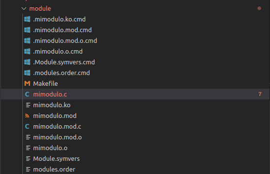

# TP4 Sistemas de Computacion

## Desafio 1:

1) 
checkinstall es una utilidad en sistemas Linux que se utiliza para instalar y administrar paquetes de software. Se utiliza principalmente para instalar software que se compila a partir del código fuente.

Cuando compilas un software desde el código fuente y lo instalas usando make install, el software se instala en tu sistema, pero el gestor de paquetes de tu sistema no tiene conocimiento de ello. Esto puede hacer que sea difícil rastrear y eliminar completamente ese software en el futuro.

Aquí es donde checkinstall resulta útil. En lugar de usar make install, usas checkinstall. checkinstall ejecutará make install, pero también creará un paquete (como un .deb en Debian/Ubuntu, o un .rpm en Fedora/RHEL) que luego se instala a través del gestor de paquetes de tu sistema. Esto significa que el gestor de paquetes ahora tiene conocimiento del software y puedes usar las herramientas normales de gestión de paquetes para eliminar o actualizar el software en el futuro.

2) 

## Desafío 1 (filminas)
La firma del kernel es una característica de seguridad utilizada para garantizar la integridad y autenticidad tanto del kernel como de los módulos del kernel en Linux. A través de la firma digital, se asegura que el código del kernel y sus módulos no hayan sido modificados y que provengan de una fuente confiable.

Luego de investigar sobre otros métodos de seguridad aplicable al kernel de nuestro sistema podemos destacar las siguientes:

- *Kernel Hardening*: consiste en una serie de patches o modificaciones del kernel que aseguran mayor seguridad del mismo. Algunas de ellas son Grsecurity/PaX (mecanismos de protección de memoria).
- *Mecanismos de control de acceso*: Podemos destacar sistemas MAC (mandatory access control) como lo son SELinux o AppArmor para reforzar las políticas de seguridad, y sistemas RBAC (Role-Based Access Control) con herramientas como pam_role roles y permisos dentro del sistema.
- *Seccomp* (Secure Computing Mode): utilizado para restringir la cantidad de syscalls que un programa puede realizar


## Desafio 2:
*Mi primer modulo*




*Preguntas*

1. ¿Cómo empiezan y cómo terminan los programas y los módulos?
Programas:
Inicio:
  - Carga: El cargador del sistema operativo (loader) carga el programa en memoria.
  - Ejecución: La ejecución comienza en el punto de entrada definido, generalmente la función main en lenguajes como C y C++.
  - Inicialización: Se inicializan las variables globales y estáticas. Se reserva memoria para el stack y el heap.
Terminación:
  - Ejecución de return o exit: Al finalizar la función main o al llamarse exit, el programa devuelve un código de salida al sistema operativo.
  - Liberación de recursos: Se liberan todos los recursos asignados (memoria, archivos, etc.).
  - Destrucción de variables estáticas: Se ejecutan destructores de variables estáticas en C++.

Módulos:
Inicio:
  - Carga: El módulo se carga en el espacio del kernel usando herramientas como insmod o modprobe.
  - Inicialización: Se ejecuta la función de inicialización definida en el módulo, por ejemplo, module_init en Linux.
Terminación:
  - Desactivación: Se ejecuta la función de limpieza/desactivación del módulo, por ejemplo, module_exit en Linux.
  - Descarga: El módulo se descarga del espacio del kernel usando herramientas como rmmod.

2. Funciones disponibles en un programa y un módulo:
Programa:
  - Un programa en el espacio de usuario puede llamar a funciones definidas en sus propias bibliotecas, así como a funciones del sistema operativo a través de llamadas al sistema (syscalls). Por ejemplo, printf, malloc, y open son funciones que un programa puede utilizar.
  - Las funciones disponibles en un programa dependen de las bibliotecas vinculadas y del propio código del programa.

Módulo:
  - Un módulo, particularmente en el contexto del kernel, como un módulo de kernel en Linux, tiene acceso a un conjunto diferente de funciones. Puede llamar a funciones internas del kernel y manipular recursos del sistema a un nivel más bajo.
  - Ejemplos de funciones de un módulo del kernel incluyen printk, kmalloc, y schedule.

3. Espacio de usuario o espacio del kernel:
Espacio de usuario:
  - Es el área de la memoria donde se ejecutan las aplicaciones de usuario. Tiene restricciones de acceso para prevenir que un programa malicioso o defectuoso pueda dañar el sistema.
  - Los programas en espacio de usuario deben usar llamadas al sistema (syscalls) para interactuar con el kernel.

Espacio del kernel:
  - Es el área de la memoria donde se ejecuta el núcleo del sistema operativo y sus módulos. Tiene acceso completo a todo el hardware y puede ejecutar cualquier instrucción de la CPU.
  - Solo el código del kernel y los módulos del kernel pueden ejecutarse en este espacio.

4. Espacio de datos:
Usuario:
  - Sección de datos: Contiene variables globales y estáticas inicializadas.
  - Sección BSS: Contiene variables globales y estáticas no inicializadas.
  - Heap: Memoria dinámica asignada durante la ejecución mediante funciones como malloc.
  - Stack (pila): Memoria para variables locales y seguimiento de llamadas a funciones.

Kernel:
  - Sección de datos del kernel: Contiene variables globales del kernel.
  - Sección BSS del kernel: Similar a la del espacio de usuario, pero para datos del kernel.
  - Heap del kernel: Memoria dinámica para estructuras del kernel.
  - Stack del kernel: Memoria utilizada por las funciones del kernel.
  - Espacio de código:

Espacio de código:
Usuario:
  - Text segment: Contiene el código ejecutable del programa. Es de solo lectura para prevenir modificaciones accidentales o maliciosas.

Kernel:
  - Text segment del kernel: Contiene el código ejecutable del kernel. También es de solo lectura.

Riesgos:
Espacio de usuario:
  - Desbordamiento de buffer: Puede corromper la memoria y permitir la ejecución de código malicioso.
  - Uso indebido de punteros: Puede causar acceso a memoria no válida, provocando fallos del programa.

Espacio del kernel:
  - Desbordamiento de buffer en el kernel: Puede permitir la ejecución de código malicioso con privilegios elevados, comprometiendo todo el sistema.
  - Errores en controladores: Pueden causar inestabilidad del sistema y vulnerabilidades de seguridad.

5. Drivers. Investigar contenido de /dev.

*Drivers*

¿Qué son los Drivers?
  - Los drivers, o controladores de dispositivo, son programas que permiten al sistema operativo interactuar con el hardware. Actúan como intermediarios, traduciendo las instrucciones del sistema operativo en acciones específicas que el hardware puede realizar.

Función y Propósito de los Drivers
  - Interfaz Abstracción:
        Los drivers proporcionan una interfaz estándar para que el software pueda interactuar con el hardware sin necesidad de conocer los detalles específicos de su funcionamiento.
        Esto permite que el mismo software funcione en diferentes tipos de hardware con solo cambiar el driver.
  - Comunicación:
        Los drivers manejan la comunicación entre el sistema operativo y el hardware, enviando comandos al hardware y recibiendo datos y estado del hardware.
        Esta comunicación puede incluir operaciones de entrada/salida, transferencia de datos, y control de hardware.

Tipos de Drivers
  - Drivers de Dispositivos:
     - Drivers de Bloques: Gestionan dispositivos que almacenan datos en bloques, como discos duros, SSDs, y otros dispositivos de almacenamiento masivo.
        Ejemplos: ext4, NTFS, FAT32.
     - Drivers de Caracteres: Gestionan dispositivos que manejan datos como una secuencia de caracteres, como teclados, ratones, y puertos seriales.
        Ejemplos: keyboard, mouse, tty.

  - Drivers de Red: Gestionan dispositivos de red como tarjetas de red (NICs) y adaptadores inalámbricos.
    Ejemplos: e1000, rtl8139, iwlwifi.

  - Drivers de Interfaz de Usuario: Gestionan dispositivos de entrada/salida que interactúan con el usuario, como monitores y tarjetas gráficas.
    Ejemplos: nvidia, radeon, intel.

  - Drivers de Sistema: Gestionan hardware del sistema como controladores de bus, controladores de memoria, y otros componentes internos.
    Ejemplos: pci, usb, acpi.

Cómo Funcionan los Drivers?
- Inicialización: 
    - Al arrancar el sistema, el kernel carga los drivers necesarios y los inicializa para que puedan gestionar sus respectivos dispositivos.
    - Los drivers registran sus dispositivos y funciones con el kernel, creando interfaces en /dev o gestionando recursos del sistema.
- Manejo de E/S:
    - Los drivers manejan las operaciones de entrada/salida (E/S) para sus dispositivos.
    - Para un dispositivo de bloques, esto puede incluir leer y escribir datos en sectores específicos.
    - Para un dispositivo de caracteres, esto puede incluir manejar interrupciones de teclado o datos de un puerto serial.

- Interrupciones:
 - Los drivers gestionan interrupciones de hardware, que son señales enviadas por el hardware al procesador para indicar que una operación ha sido completada o que necesita atención.
    Ejemplo: Una tarjeta de red puede enviar una interrupción cuando recibe un paquete de datos.

- Control y Configuración:
 - Los drivers proporcionan funciones para controlar y configurar el hardware.
 - Esto puede incluir cambiar la configuración de un dispositivo, actualizar firmware, o realizar diagnósticos.

Desarrollo y Mantenimiento de Drivers
 - Escritura de Drivers:
    - Los drivers se escriben en lenguajes de bajo nivel como C o ensamblador para permitir un control preciso del hardware.
    - Los desarrolladores de drivers deben entender bien tanto el hardware como el sistema operativo para escribir controladores eficientes y seguros.

 - Kernel Modules:
    - En sistemas como Linux, los drivers a menudo se implementan como módulos del kernel que pueden ser cargados y descargados dinámicamente.
    - Esto permite actualizar o cambiar drivers sin necesidad de reiniciar el sistema.

 - Actualizaciones y Parcheo:
 - Los drivers deben mantenerse actualizados para corregir errores, mejorar el rendimiento y añadir compatibilidad con nuevo hardware.
 - Las actualizaciones de drivers se distribuyen a menudo junto con actualizaciones del sistema operativo.

Riesgos y Seguridad
 - Estabilidad del Sistema:
    - Un driver defectuoso puede causar inestabilidad del sistema, fallos del kernel (p. ej., pantallas azules en Windows) o bloqueos.
 - Seguridad:
    - Los drivers operan con altos privilegios en el sistema, por lo que un driver vulnerable puede ser explotado para comprometer la seguridad del sistema.
    - Mantener los drivers actualizados y utilizar solo drivers de fuentes confiables es crucial para la seguridad.

*/dev*

El directorio /dev es esencial para la operación de un sistema Unix/Linux, ya que proporciona una interfaz unificada y estandarizada para interactuar con una amplia variedad de hardware. Sin esta abstracción, los desarrolladores de software tendrían que manejar directamente las complejidades del hardware, lo cual sería impráctico y propenso a errores.

Acceso y Seguridad
- El acceso a los archivos de dispositivo en /dev está estrictamente controlado mediante permisos de archivos para asegurar que solo los usuarios y procesos autorizados puedan interactuar con el hardware. Esto es crucial para mantener la integridad y seguridad del sistema, ya que un acceso no autorizado podría llevar a corrupción de datos o comprometer la seguridad del sistema.

Gestión de Drivers
 - Escritura y Desarrollo de Drivers
    - Lenguajes de Programación: Los drivers se escriben típicamente en lenguajes de bajo nivel como C o ensamblador debido a la necesidad de controlar directamente el hardware y operar en un entorno restringido del kernel.
    - Interfaz del Kernel: Los desarrolladores deben entender bien las APIs y estructuras de datos del kernel del sistema operativo para crear drivers que interactúen eficazmente con el sistema y el hardware.
 - Carga y Descarga de Drivers
    - Módulos del Kernel: En sistemas como Linux, los drivers se implementan a menudo como módulos del kernel. Estos módulos pueden ser cargados (insertados) y descargados (eliminados) dinámicamente usando herramientas como modprobe, insmod, y rmmod.
 - Actualización y Mantenimiento
    - Actualizaciones: Mantener los drivers actualizados es crucial para corregir errores, mejorar el rendimiento y la compatibilidad, y cerrar vulnerabilidades de seguridad.
    - Parcheo de Seguridad: Los drivers deben ser auditados y parcheados regularmente para prevenir y mitigar riesgos de seguridad.
- Interactuar con los Dispositivos
    - Operaciones Básicas
        - Abrir y Cerrar Dispositivos: Los programas pueden abrir archivos de dispositivo en /dev utilizando funciones del sistema como open y close. Esto establece una conexión entre el programa y el dispositivo.
        - Lectura y Escritura: Los datos pueden ser leídos de y escritos a los dispositivos usando funciones como read y write.
- Control de Dispositivos
    - ioctl (Input/Output Control): Esta función permite a los programas enviar comandos específicos a los dispositivos, más allá de las operaciones básicas de lectura y escritura. Proporciona una interfaz para realizar configuraciones y obtener información del dispositivo.

Cómo Funcionan los Archivos de Dispositivo
- Estructura de Archivos de Dispositivo
    - Número Mayor y Menor: Cada archivo de dispositivo tiene un número mayor y un número menor que identifican el controlador del dispositivo y el dispositivo específico, respectivamente.
        - Número Mayor: Identifica el tipo de dispositivo y el controlador asociado.
        - Número Menor: Identifica el dispositivo específico manejado por el controlador.
- Creación de Archivos de Dispositivo
    - mknod: La creación de archivos de dispositivo se puede realizar manualmente utilizando el comando mknod, especificando el tipo de dispositivo, y los números mayor y menor.
    ```bash
    sudo mknod /dev/nuevo_dispositivo c 123 0
    ```

- Función en el Sistema
    - Interfaz Estándar: Los archivos de dispositivo proporcionan una interfaz estandarizada para que los programas puedan interactuar con el hardware sin necesidad de conocer los detalles específicos de su funcionamiento.
    - Abstracción de Hardware: Permiten que diferentes aplicaciones y servicios del sistema operen con el hardware de manera consistente y predecible.


## Desafío Docs:

### Modules info

Podemos utilizar el comando modinfo para imprimir algunos detalles sobre el módulo especificado, en nuestro caso lo corremos con mimodulo.ko : 


En este caso podemos ver una serie de atributos sobre el módulo como lo son el path donde se encuentra localizado, el autor, una descripción del mismo (ambos datos cargados utilizando macros específicas), srcversion (un hash representando la versión del módulo), sus dependencias, el nombre y por último vermagic, que hace referencia a información sobre el kernel y compilador utilizados, asegurando compatibilidad.

Por otro lado, al ejecutar el comando modinfo /lib/modules/$(uname -r)/kernel/crypto/des_generic.ko, veremos la salida con información sobre el módulo des_generic.ko, el cual se encarga de realizar tareas de encriptación, específicamente la implementación de los algoritmos DES (Data Encryption Standard) y Triple DES (3DES), formando parte de la API de criptografía del kernel.


En este output vemos algunos de los mismos campos que con mimodulo pero propios del nuevo módulo analizado incluidos: 

- alias : nombres alternativos para referenciar el módulo desde el sistema
- retpoline (return trampoline) : técnica de mitigación de la vulnerabilidad Spectre v2 activada evitando el uso de instrucciones sobre ramas indirectas.
- intree : es decir, incluido en el árbol fuente del kernel de Linux main, por lo que el módulo es mantenido y distribuido como parte de las versiones oficiales de Linux.
- signer : entidad que firma el módulo.
- sig_id: identifica de manera única la firma del módulo.
- sig_key: identifica la llave utilizada para firmar el módulo.
- sig_hashlogo : el algoritmo de hashing utilizado.
- signature: la firma encriptada propiamente dicha.

### Device drivers cargados y disponibles

Para visualizar los drivers/módulos que se están utilizando en nuestras PC podemos utilizar el comando lsmod (list modules), consiguiendo un output como el siguiente, donde se alcanzan a ver los módulos, su tamaño y las instancias utilizadas del mismo: 


Para visualizar los módulos disponibles pero q no estan cargados podemos utilizar un script escrito en bash que compare las salida de lsmod con las del comando find   /lib/modules/$(uname -r)/kernel/ -type f -name '*.ko', que lista todos los módulos guardados en el path indicado (donde comúnmente se guardan los módulos del kernel).

```bash 
#!/bin/bash

# List all available modules
available_modules=$(find /lib/modules/$(uname -r)/kernel/ -type f -name '*.ko' | sed 's/.*\///;s/\.ko//')

# List all loaded modules
loaded_modules=$(lsmod | awk 'NR>1 {print $1}')

# Compare lists and show modules that are available but not loaded
echo "Available but not loaded modules:"
for module in $available_modules; do
  if ! echo "$loaded_modules" | grep -qw "$module"; then
	echo "$module"
  fi
done
```
La salida del script es enorme pero algunos de los nombres de los módulos disponibles pero no cargados son: 


